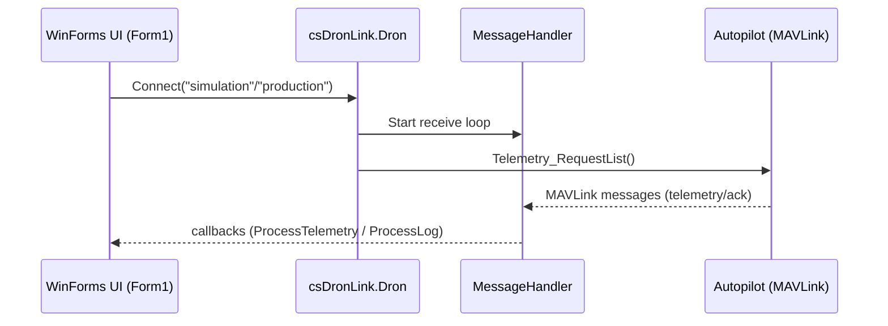

# Drone Ground Station + csDronLink (C# / MAVLink)

A **Windows Ground Control Station** (WinForms) written in **C# / .NET Framework** and a companion **C# library** (**csDronLink**) that wraps **MAVLink** into a higher-level API (connect, telemetry, takeoff/land/RTL, missions, geofences/scenarios, parameters, indoor/outdoor navigation).

> ⚠️ **Safety**: This project can control real vehicles. Use **only in controlled environments** and always keep a reliable **failsafe** available.

---

## Table of Contents

1. [Repository Overview](#repository-overview)  
2. [Quick Start](#quick-start)  
3. [Requirements](#requirements)  
   1. [Tooling](#tooling)  
   2. [Framework Targets](#framework-targets)  
   3. [NuGet Dependencies](#nuget-dependencies)  
4. [Build & Run](#build--run)  
   1. [Build csDronLink (Library)](#build-csdronlink-library)  
   2. [Build GroundStation (App)](#build-groundstation-app)  
   3. [Run in Simulation Mode](#run-in-simulation-mode)  
   4. [Run in Production Mode](#run-in-production-mode)  
5. [Repository Structure](#repository-structure)  
6. [csDronLink Library](#csdronlink-library)  
   1. [What the Library Provides](#what-the-library-provides)  
   2. [C# Design Choices](#c-design-choices)  
   3. [Library Structure](#library-structure)  
   4. [Message Handling (Sync vs Async)](#message-handling-sync-vs-async)  
   5. [API Quick Reference](#api-quick-reference)  
   6. [Telemetry Pipeline](#telemetry-pipeline)  
   7. [Missions](#missions)  
   8. [Scenarios / Geofences](#scenarios--geofences)  
   9. [Parameters](#parameters)  
   10. [Indoor Movement](#indoor-movement)  
7. [GroundStation Application](#groundstation-application)  
   1. [Architecture](#architecture)  
   2. [Code Organization](#code-organization)  
   3. [Connect + Heartbeat](#connect--heartbeat)  
   4. [Outdoor Map Mode](#outdoor-map-mode)  
   5. [Indoor Mode](#indoor-mode)  
   6. [Geofence Checks + Safety Modes](#geofence-checks--safety-modes)  
   7. [Missions UI](#missions-ui)  
   8. [Joystick / RC Override](#joystick--rc-override)  
   9. [Camera Streaming](#camera-streaming)  
   10. [SetupForm](#setupform)  
8. [Configuration Hotspots](#configuration-hotspots)  
9. [Extending the Project](#extending-the-project)  
10. [Troubleshooting](#troubleshooting)  

---

## Repository Overview

This project is built around **two components**:

- **csDronLink** (**Class Library**, `.NET Framework 4.7.2`)  
  A MAVLink client library that:
  - connects to an autopilot via **Serial (production)** or **TCP (simulation)**,
  - encodes MAVLink commands (takeoff, land, missions, parameter ops, etc.),
  - parses MAVLink telemetry packets,
  - provides a **high-level C# API** via a single `Dron` class (implemented as a **partial class** split across multiple files).

- **GroundStation (GndStation)** (**WinForms App**, `.NET Framework 4.8`)  
  A user interface that:
  - connects to the drone using **csDronLink**,
  - displays **telemetry + diagnostics**,
  - supports **outdoor navigation** (map) and **indoor navigation** (Cartesian plane),
  - supports **mission planning**, **geofences**, **joystick control**, and **camera streaming** (experimental).

---

## Quick Start

If you just want to run the UI:

1. Open `GroundStation/.../GndStation.sln` with **Visual Studio 2022**.
2. Restore **NuGet packages** (VS will prompt you).
3. Build and run the `GndStation` project.
4. In the UI, choose:
   - **Simulation** → if you have a MAVLink TCP endpoint available at `127.0.0.1:5763`
   - **Production** → if your autopilot is on a Windows **COM** port at **57600 baud**

---

## Requirements

### Tooling

- **Windows** (WinForms + SerialPort/DirectInput expectations)
- **Visual Studio 2022** (solution is VS17)
- **NuGet** (packages are managed via `packages.config`)

### Framework Targets

- **csDronLink** targets **.NET Framework 4.7.2**
- **GroundStation** targets **.NET Framework 4.8**

> ✅ Install the **.NET Framework Developer Packs** for 4.7.2 and 4.8 (or at least the required targeting packs) if Visual Studio reports missing frameworks.

### NuGet Dependencies

Both projects use **packages.config**, so the complete dependency list is the authoritative `packages.config` file in each project.

#### csDronLink – key packages

- **EntityFramework** `6.4.4`
- **GMap.NET.Core / Windows / WinForms / WinPresentation** `2.1.7`
- **Newtonsoft.Json** `13.0.1`
- **System.Data.SQLite** stack `1.0.115.5`
- **System.Data.SqlClient** `4.8.3`

#### GroundStation – key packages

GroundStation adds UI + input + media stacks, including:

- **GMap.NET** `2.1.7` (map rendering)
- **EntityFramework** `6.5.1`
- **SharpDX / SharpDX.DirectInput** `4.2.0` (joystick)
- **SharpGL** `3.1.1` (OpenGL UI components)
- **FFmpeg.AutoGen** `7.0.0`
- **SIPSorcery** `8.0.23` + **SIPSorceryMedia** `3.0.1` (WebRTC/media building blocks)
- **FM.IceLink.WebRTC** `2.9.32`
- **Newtonsoft.Json** `13.0.4`

> ℹ️ Some packages appear with `targetFramework="net472"` even though the project targets net48. This is typical in `packages.config` projects and usually still works because net48 is compatible with many net472-targeted assemblies.

---

## Build & Run

### Build csDronLink (Library)

1. Open `Dronlink_Library/.../csDronLink/csDronLink.csproj`.
2. Restore NuGet packages for the solution/project.
3. Build.

**Output**: `csDronLink.dll` (in `bin/Debug` or `bin/Release`).

> 🔁 **Important**: GroundStation references **a DLL**, not the library project.  
> If you modify the library source, you must **rebuild** and then **copy the new `csDronLink.dll`** to the location expected by the GroundStation project (see below).

---

### Build GroundStation (App)

1. Open `GroundStation/.../GndStation.sln`.
2. Restore NuGet packages.
3. Ensure the file `csDronLink.dll` is present where the project expects it.

GroundStation’s `.csproj` references csDronLink with a **HintPath** similar to:

- `..\..\csDronLink.dll`

Meaning: the DLL must be **two folders above** the `GndStation.csproj` file (i.e., next to the `GndStation` folder in the repository layout).

4. Build and run.

---

### Run in Simulation Mode

In **simulation**, csDronLink uses **TCP**:

- IP: **127.0.0.1**
- Port: **5763** for drone id **1**
- Multi-drone mapping: `5763 + (id - 1) * 10`  
  Example:
  - id=1 → 5763
  - id=2 → 5773
  - id=3 → 5783

> ✅ You must have a **MAVLink TCP endpoint** listening on that port.

---

### Run in Production Mode

In **production**, csDronLink uses **SerialPort**:

- Port: a Windows **COM** port (selected by the user)
- Baud rate: **57600** (hardcoded in the library)

---

## Repository Structure

A typical repository layout (as delivered in this project) looks like:

```
.
├─ Dronlink_Library/
│  └─ Dronlink_Library/
│     ├─ csDronLink/
│     │  ├─ Dron*.cs                  # Dron partial class split by feature
│     │  ├─ MessageHandler.cs         # MAVLink receive loop + dispatch
│     │  ├─ MavlinkParse.cs, mavlink.cs, ...  # MAVLink parsing/definitions
│     │  ├─ csDronLink.csproj
│     │  └─ packages.config
│     └─ packages/                    # NuGet packages for csDronLink
│
├─ GroundStation/
│  └─ GroundStation/
│     ├─ csDronLink.dll               # Binary reference used by the app
│     └─ GndStation/
│        ├─ GndStation.sln
│        ├─ packages/                 # NuGet packages for GroundStation
│        └─ GndStation/
│           ├─ Form1*.cs              # Main UI (partial class)
│           ├─ SetupForm*.cs          # Setup UI (parameters/scenarios)
│           ├─ Telemetry.cs           # Telemetry parsing + UI updates
│           ├─ Geofence.cs            # Fence checks + safety actions
│           ├─ RC_command.cs          # Joystick / RC override
│           ├─ CameraWebsockets.cs    # WS video client (experimental)
│           ├─ CameraWebrtc.cs        # WebRTC via Python bridge (experimental)
│           ├─ CartesianPlaneControl.cs  # Indoor map control
│           ├─ GndStation.csproj
│           └─ packages.config
│
└─ csDronLinkDocTopics.docx           # Library “topic list” reference (documentation source)
```

> ✅ Recommendation for GitHub hygiene: add a `.gitignore` for Visual Studio and do **not** commit `bin/`, `obj/`, `.vs/`, and `packages/` (unless you intentionally vendor packages).

---

# csDronLink Library

## What the Library Provides

The main entry point is the **`csDronLink.Dron`** class:

- Connect:
  - **Production** via **SerialPort**
  - **Simulation** via **TCP**
- Basic commands:
  - **Arm / Disarm**
  - **Takeoff / Land / RTL**
- Navigation & movement:
  - “navigate continuously” (directional setpoint loop)
  - “move a fixed distance” (relative steps)
  - “go to a global waypoint”
- Missions:
  - upload mission items
  - execute mission (with optional per-waypoint callback)
  - cancel mission
- Scenarios / geofences:
  - upload inclusion/exclusion fences
  - read fences back from the autopilot
- Parameters:
  - read parameters
  - set a parameter
  - request a full parameter list and then write multiple parameters
- Telemetry + diagnostics:
  - register client callbacks and stream decoded values
- Indoor movement helpers:
  - local NED relative and absolute moves
- Heartbeat loop:
  - periodic GCS heartbeat to keep link “alive”

---

## C# Design Choices

This project uses several **C#-specific** patterns and features worth highlighting:

### 1) **Partial classes** (big class, split by topic)

`Dron` is implemented as a **partial class**, split across multiple files:

- `Dron_basics.cs` → takeoff/land/RTL/arm
- `Dron_mission.cs` → mission upload/execute/cancel
- `Dron_parameters.cs` → parameter list, write parameters
- …and so on

This keeps one public API type (`Dron`) while organizing the implementation by feature.

GroundStation uses the same approach for the UI:

- `Form1` is split into `UI1.cs`, `Telemetry.cs`, `Geofence.cs`, etc.

### 2) **Delegates and callbacks** (`Action<...>`)

Many operations accept callbacks so the UI can remain responsive. In csDronLink, callbacks frequently use:

- `Action<byte, object>` → (droneId, userParam)  
- `Action<byte, uint, List<...>>` → (droneId, mavlinkMsgId, decodedValues)

This is a classic WinForms-era alternative to async/await.

### 3) **Tuples and generics**

You will see signatures such as:

- `List<((float lat, float lon), float alt)>`
- `List<(string name, float value)>`
- `Dictionary<string, (float value, MAV_PARAM_TYPE type)>`

Tuples make “data packets” very compact without defining many small DTO classes.

### 4) **Manual threading**

Both the library and the UI rely on `Thread` and `Task.Run()`:

- a dedicated receive loop reads MAVLink packets continuously
- UI background loops keep maps refreshed or enforce safety checks

In WinForms, UI updates must be marshalled using **`Invoke` / `BeginInvoke`** when running on a background thread.

---

## Library Structure

Below is how the library is organized (major files):

| File | Purpose |
|------|---------|
| `Dron.cs` | Fields, constructor, connect logic (Serial/TCP), message sending |
| `MessageHandler.cs` | The MAVLink receive loop + dispatch model (sync wait vs async callbacks) |
| `Dron_telemetry.cs` | Telemetry request list + packet decoders + callback dispatch |
| `Dron_basics.cs` | Takeoff / Land / RTL / Arm / Disarm |
| `Dron_navigation.cs` | Continuous navigation (“remind setpoint” loop) |
| `Dron_movement.cs` | Relative move + GoToWaypoint |
| `Dron_mission.cs` | Upload / Execute / Cancel mission |
| `Dron_scenes.cs` | Scenario upload + download (geofences) |
| `Dron_parameters.cs` | Read/write parameters + request full list |
| `Dron_FlightModes.cs` | Mode mapping + SetFlightMode |
| `dron_heartbeat.cs` | Start/stop heartbeat loop |
| `Dron_changevel.cs` | Guided mode + speed/heading changes |
| `Dron_moveIndoor.cs` | Indoor/local moves (relative + absolute) |
| `mavlink.cs`, `MavlinkParse.cs`, `MAVLinkMessage.cs`, ... | MAVLink structs, parsing, CRC, utilities |

---

## Message Handling (Sync vs Async)

`MessageHandler` is the core “traffic controller” for incoming MAVLink packets.

### Receive loop

- Runs a background loop that reads bytes from:
  - **SerialPort** (production) OR
  - **NetworkStream** (simulation)
- Parses MAVLink packets via `MavlinkParse`.
- Dispatches decoded messages.

### Two dispatch modes

1) **Synchronous waiting** (blocking)  
   Used when a command needs to wait for a response (ACK) or a telemetry condition.

   `MessageHandler` supports patterns like:
   - wait for “message X”
   - wait for “message X that satisfies condition Y”
   - with timeout

   API examples:
   - `WaitForMessageBlock(...)`
   - `WaitForMessageNoBlock(...)`

2) **Asynchronous subscriptions** (telemetry / diagnostics)  
   Used for continuous streams.  
   Handlers are invoked using `Task.Run()` so the receive loop stays fast.

---

## API Quick Reference

> The official topic list is summarized in `csDronLinkDocTopics.docx`.  
> **Note**: the Word doc reflects an earlier naming style (`Connect`, `UpLoadMission`, etc.). In code, the active methods are named as shown below.

### Connection

```csharp
public Dron(byte id = 1);
public void Connect(string mode, string connector = null);
```

- `mode == "production"` → SerialPort, **57600 baud**
- else → TCP to `127.0.0.1` at port `5763 + (id-1)*10`

### Basic commands

```csharp
public void Arm();
public void Disarm();
public void Takeoff(int altitude, Boolean block = true,
    Action<byte, object> f = null, object param = null);

public void Land(Boolean block = true,
    Action<byte, object> f = null, object param = null);

public void RTL(Boolean block = true,
    Action<byte, object> f = null, object param = null);
```

> **Blocking vs non-blocking**:  
> When `block == false`, the library typically spawns a background thread and calls `f(droneId, param)` when done.

### Navigation & movement

```csharp
public void Navigate(string direction);

public void Move(string direction, int distance,
    Boolean heading = true, Boolean blocking = true,
    Action<byte, object> f = null, object param = null);

public void GoToWaypoint(float lat, float lon, float alt,
    Boolean blocking = true, Action<byte, object> f = null, object param = null);
```

Directions:
- Navigate: `North`, `South`, `West`, `East`, `NorthWest`, `NorthEast`, `SouthWest`, `SouthEast`
- Move: `Forward`, `Back`, `Left`, `Right`, `Up`, `Down`, plus diagonals and `Stop`

### RC override (joystick)

```csharp
public void Send_RC_Override(List<ushort> channels);
```

Roll/Pitch/Throttle/Yaw values in **[1000..2000]**.

### Missions

```csharp
public void UploadMission(List<((float lat, float lon), float alt)> mission);

public void ExecuteMission(
    bool blocking = true,
    Action<byte, object> OnWaypointReached = null,
    Action<byte, object> f = null,
    object param = null);

public void CancelMission();
```

### Scenarios / fences (geofences)

```csharp
public void SetScenario(List<List<(float lat, float lon)>> scenario);

public List<(List<(float lat, float lon)> vertices, string type)> GetScenario();
```

A **scenario** is:
- `scenario[0]` = **inclusion fence** polygon (≥ 3 points)
- `scenario[1..]` = **exclusion fences** (polygons or circles)

Circle convention (as documented):
- 2 points:
  - point 1 = circle center
  - point 2 latitude encodes the **radius in meters**

### Parameters

```csharp
public List<(string name, float value)> ReadParameters(List<string> parameters);

public void Set_Parameter(string name, float value);

public Dictionary<string, (float value, MAVLink.MAV_PARAM_TYPE type)> RequestAllParameters();

public List<(string name, float value)> ReadParametersViaListStreamed(List<string> parameters);

public void WriteParameters(List<(string parameter, float value)> parameters);
```

### Flight modes

```csharp
public void SetFlightMode(string mode, byte vehicleSysId = 1, byte gcsSysId = 255);
```

Internally maps mode names like `"LOITER"` to MAVLink mode codes.

### Heartbeat

```csharp
public void StartHeartbeatLoop(byte gcsSysId = 255);
public void StopHeartbeatLoop();
public void SendGcsHeartbeat(byte gcsSysId = 255);
```

### Telemetry + diagnostics

```csharp
public void SendTelemetryDataToClient(
    Action<byte, uint, List<(string name, float value)>> f);

public void SendDiagnosticDataToClient(
    Action<byte, uint, List<(string name, string text)>> f);

public void StopTelemetryData();
public void RegisterTelemetry(MAVLinkMessage msg);
public void Telemetry_RequestList();
```

### Guided mode / speed / heading

```csharp
public void SetGuidedMode();
public void ChangeSpeed(int speed);
public void ChangeHeading(float newHeading, bool blocking = true,
    Action<byte, object> f = null, object param = null);
```

### Indoor movement

```csharp
public void MoveIndoor(float x, float y, float z,
    bool heading = true, bool blocking = true,
    Action<byte, object> f = null, object param = null);

public void MoveIndoor_Abs(float x, float y, float z,
    float vx = 0, float vy = 0, float vz = 0,
    float ax = 0, float ay = 0, float az = 0,
    bool mask = true, bool heading = true,
    bool blocking = true, Action<byte, object> f = null, object param = null);
```

---

## Telemetry Pipeline

### 1) Requesting telemetry

During `Connect(...)`, the library calls:

- `Telemetry_RequestList()`

This sends MAVLink “message interval” requests so the autopilot starts streaming:
- Global position
- Local position
- Attitude
- Battery
- IMU
- Heartbeat
- (and others depending on version)

### 2) Registering a client callback

A consumer (GroundStation) registers:

- `SendTelemetryDataToClient(ProcessTelemetry)`
- optionally `SendDiagnosticDataToClient(ProcessLog)`

### 3) Decoding packets

Each MAVLink packet type is decoded into a **list of `(name, value)`** tuples (or `(name, text)` for diagnostics). This keeps the UI layer decoupled from raw MAVLink structs.

---

## Missions

Missions are handled through the MAVLink mission protocol:

1. **Upload**
   - clear existing mission items on autopilot
   - send mission item count
   - respond to mission item requests and send items

2. **Execute**
   - set auto/mission mode as required
   - monitor progress (optionally call `OnWaypointReached`)

3. **Cancel**
   - clear mission items and reset counters

> ⚠️ The Word documentation notes that cancel may not clear internal handler queues. Always test cancellation behavior on your target autopilot setup.

---

## Scenarios / Geofences

The library models scenarios as mission-like fence items:
- one **inclusion** fence (allowed area)
- multiple **exclusion** fences (obstacles/no-fly subareas)

GroundStation also implements a *software-side* geofence monitor (see below) that can take safety actions if the vehicle exits bounds.

---

## Parameters

The parameter subsystem provides:

- **ReadParameters(listOfNames)**  
  for targeted reads.

- **RequestAllParameters()**  
  tries to download the full list and build a dictionary mapping parameter name → (value, type).

- **WriteParameters(list)**  
  applies a parameter profile efficiently (used by SetupForm to switch configurations).

---

## Indoor Movement

Indoor functions are designed for motion in a local coordinate system:

- relative displacement (`MoveIndoor`)
- absolute target (`MoveIndoor_Abs`), origin = takeoff point

This supports indoor flight where GPS is not available and the vehicle is localized via optical flow, VIO, or other local sources.

---

# GroundStation Application

## Architecture

GroundStation is a WinForms UI that builds on csDronLink:



---

## Code Organization

### Form1 is a **partial class**

The main form `Form1` is split into multiple files. This is a common WinForms pattern to keep the class readable:

| File | Responsibility |
|------|----------------|
| `Form1.cs` | Global state, map/plane initialization, shared variables |
| `UI1.cs` | Main buttons: connect, takeoff, move, mission actions, telemetry toggle |
| `EventHandlers.cs` | Map right-click menus + indoor plane event wiring |
| `Telemetry.cs` | Telemetry parsing, UI updates, drawing drone marker/lines |
| `Geofence.cs` | Fence creation + point-in-polygon checks + safety actions |
| `RC_command.cs` | Joystick polling + RC override transmission |
| `Helpers.cs` + `Helpers/General.cs` | Utility helpers and shared routines |
| `CallBacks.cs` | Completion callbacks from non-blocking drone actions |
| `CameraWebsockets.cs` | WebSocket video client (experimental) |
| `CameraWebrtc.cs` | WebRTC via external Python script (experimental) |

### SetupForm is also split

| File | Responsibility |
|------|----------------|
| `SetupForm.cs` | Parameter and scenario UI; holds reference to main form + drone |
| `UI2.cs` | Read/write/save/load parameters; enable geofence monitor; scenario upload/read |

---

## Connect + Heartbeat

When the UI connects it typically:

1. Instantiates a `Dron` object:
   - `drone = new Dron();` (default id=1)
2. Calls `drone.Connect("simulation")` or `drone.Connect("production", "COMx")`
3. Starts heartbeat:
   - `drone.StartHeartbeatLoop()`
4. If telemetry is enabled:
   - `drone.SendTelemetryDataToClient(ProcessTelemetry)`
   - `drone.SendDiagnosticDataToClient(ProcessLog)`

---

## Outdoor Map Mode

Outdoor mode is built on **GMap.NET** and uses overlays for:

- **Mission points** (waypoints and routes)
- **Geofence polygons**
- **Drone marker** and heading/velocity vectors

Telemetry messages (typically `GLOBAL_POSITION_INT`) update:
- latitude/longitude
- altitude
- heading
- map marker position and direction lines

---

## Indoor Mode

Indoor mode uses a custom **`CartesianPlaneControl`**:

- draws a grid and axes
- converts screen pixels to meters
- supports right-click actions:
  - fly here
  - add points
  - draw inclusion/exclusion fences
  - build indoor missions

Telemetry messages (`LOCAL_POSITION_NED`) update:
- local position (x,y,z)
- local velocities
- the drone marker on the plane

---

## Geofence Checks + Safety Modes

GroundStation provides two geofence layers:

1. **Scenario fences on the autopilot** (via csDronLink `SetScenario`)
2. A **software-side monitor** in GroundStation (thread-based checks)

### How the software monitor works

- `CheckForViolation(...)` runs in a background thread.
- It checks:
  - whether the drone is **outside** the inclusion polygon
  - whether the drone is **inside** any exclusion polygon
  - whether altitude exceeds **MaxAltitude**
- If violated, it calls a safety action routine.

### Safety actions

Depending on UI selection, it can trigger:
- **Land**
- **RTL**
- **Push-back** (return toward “last good point”, mainly useful indoors)

---

## Missions UI

Mission planning is primarily done via map events:

- add waypoints (outdoor map right-click menu)
- upload mission (calls `drone.UploadMission`)
- execute mission (calls `drone.ExecuteMission`)
- optionally receive per-waypoint callbacks

On mission end the UI returns to guided mode and clears overlays.

---

## Joystick / RC Override

Joystick control is implemented using **SharpDX.DirectInput**:

- a background thread polls joystick state
- axes/buttons map to RC channel values
- periodic calls to:
  - `drone.Send_RC_Override(channels)`

Buttons may also trigger:
- mode changes (e.g. GUIDED/LOITER/RTL/LAND)
- takeoff / disarm (depending on UI setup)

> ⚠️ RC override is powerful. Always test with propellers removed or in a simulator first.

---

## Camera Streaming

Two experimental camera implementations exist:

### 1) WebSocket video (`CameraWebsockets.cs`)

- Connects to:
  - `ws://10.42.0.1:8765/video`
- Expects binary frames that can be decoded into images and displayed in a `PictureBox`.

### 2) WebRTC bridge (`CameraWebrtc.cs`)

- Launches an **external Python script** using **hardcoded Windows paths**, e.g.:
  - `C:\Users\...\python.exe`
  - `C:\Users\...\webrtc.py`
- Receives frames over a TCP socket from that script.

> ✅ If you plan to use WebRTC, you should **move the Python script into the repo** and replace hardcoded paths with configuration.

---

## SetupForm

SetupForm is the “advanced configuration” UI:

- reads selected parameters using:
  - `ReadParametersViaListStreamed(...)`
- writes parameters using:
  - `Set_Parameter(...)`
  - `WriteParameters(...)`
- loads/saves parameter presets (text files)
- can upload/read scenarios:
  - `SetScenario(...)`
  - `GetScenario(...)`
- enables the geofence monitor thread.

---

## Configuration Hotspots

This project has several values that are currently **hardcoded** and may need to be changed for your environment:

- **Simulation TCP port mapping**: `5763 + (id-1)*10`
- **Production baud rate**: `57600`
- **WebSocket camera URL**: `ws://10.42.0.1:8765/video`
- **WebRTC Python paths** (Windows absolute paths)
- **Image assets loaded at runtime**:
  - `dron.png`
  - `NOE.png`

> ✅ Ensure the PNG files are copied to your output directory (e.g., `bin/Debug`) because the code loads them using relative filenames.

---

## Extending the Project

### Add a new telemetry packet to csDronLink

1. Add a new decoder method in `Dron_telemetry.cs`:
   - `Telemetry_<PacketName>(MAVLinkMessage msg)`
2. Add registration in `RegisterTelemetry(...)` based on MAVLink message id.
3. Add a request in `Telemetry_RequestList()` so the autopilot actually streams it.

### Add a new high-level command

1. Create a new partial file: `Dron_<topic>.cs`
2. Construct the appropriate MAVLink message (often `mavlink_command_long_t`)
3. Send with `SendMessage(...)`
4. Optionally use `MessageHandler.WaitForMessageBlock(...)` or telemetry conditions to implement blocking behavior.

### Make GroundStation reference the csDronLink project (recommended for development)

Currently GroundStation references a **DLL**. For active development:

- add `csDronLink.csproj` to the GroundStation solution
- replace the DLL reference with a **Project Reference**
- ensure build order builds the library first

This removes “copy DLL” friction.

---

## Troubleshooting

### “Could not load file or assembly …”
- Restore NuGet packages.
- Verify the correct **.NET Framework targeting pack** is installed.
- Ensure `csDronLink.dll` exists at the referenced HintPath.

### Telemetry enabled but no updates
- Verify your autopilot/simulator is streaming MAVLink on the expected connection.
- Ensure the TCP endpoint is reachable (simulation).
- Ensure the autopilot accepts message interval requests.

### UI freezes during commands
- Use non-blocking mode (`blocking=false`) when calling long-running commands from UI events.
- Ensure telemetry callbacks update UI using `Invoke/BeginInvoke`.

### Images not found (`dron.png`, `NOE.png`)
- Copy the PNGs into the executable working directory (typically `bin/Debug` or `bin/Release`).

---

## Documentation Source

The method/topic list for csDronLink is provided in:

- `csDronLinkDocTopics.docx`

Use it as a conceptual reference. The **code is the source of truth** for exact method signatures and current naming.
